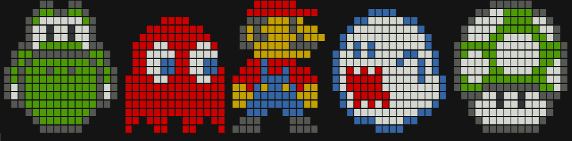
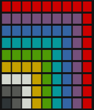

# pixelpuzzle

Puzzle Game For The R-Console. Restore the pixel art by shifting rows!




# Pixel Art

{pixelpuzzle} comes with predefined pixel art you can play with. Just start the game with `pixelpuzzle()` to select one.

In case you want to define your own pixel art you can the following codes:

* R = Red
* M = Magenta
* B = Blue
* C = Cyan
* G = Green
* Y = Yellow
* W = White
* S = Silver
* X = Black
* . = No color (transparent)

```
library(pixelpuzzle)

sprite <- c(
  "RRRRRRRRR",
  "MMMMMMMMR",
  "BBBBBBBMR",
  "CCCCCCBMR",
  "GGGGGCBMR",
  "YYYYGCBMR",
  "WWWYGCBMR",
  "SSWYGCBMR",
  "XSWYGCBMR"
)

show_sprite(sprite)
```


